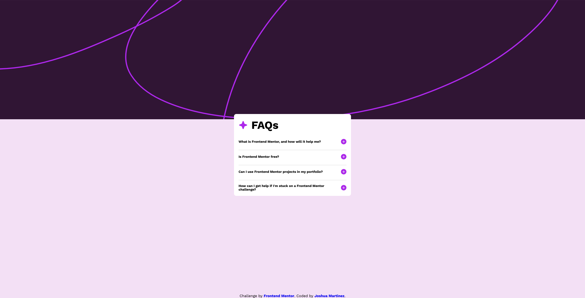

# Frontend Mentor - FAQ accordion solution

This is a solution to the [FAQ accordion challenge on Frontend Mentor](https://www.frontendmentor.io/challenges/faq-accordion-wyfFdeBwBz). Frontend Mentor challenges help you improve your coding skills by building realistic projects. 

## Table of contents

- [Overview](#overview)
  - [The challenge](#the-challenge)
  - [Screenshot](#screenshot)
  - [Links](#links)
- [My process](#my-process)
  - [Built with](#built-with)
  - [What I learned](#what-i-learned)
  - [Continued development](#continued-development)
  - [Useful resources](#useful-resources)
- [Author](#author)
- [Acknowledgments](#acknowledgments)

## Overview

### The challenge

Users should be able to:

- Hide/Show the answer to a question when the question is clicked
- Navigate the questions and hide/show answers using keyboard navigation alone
- View the optimal layout for the interface depending on their device's screen size
- See hover and focus states for all interactive elements on the page

### Screenshot



### Links

- Solution URL: [https://faq-accordion-rho-three.vercel.app/]
- Live Site URL: [https://faq-accordion-rho-three.vercel.app/]

## My process

### Built with

- Semantic HTML5 markup
- CSS custom properties
- JavaScript
- Flexbox
- Mobile-first workflow

### What I learned

```html
<div class="drop-down-container">
        <section class="accordion-header" class="top-header">
          <h2>What is Frontend Mentor, and how will it help me?</h2>
          <button class="plus-sign"></button>
        </section>
        <p class="drop-closed">
            Frontend Mentor offers realistic coding challenges to help developers improve their
            frontend coding skills with projects in HTML, CSS, and JavaScript. It's suitable for
            all levels and ideal for portfolio building.
        </p>
      </div>
```
```css
.drop-closed {
    margin-top: 1rem;
    border-style: solid;
    opacity: 0;
    display: none;
}
```
```js
function updateSymbol(numVal) {
    if (buttons[numVal].className == 'plus-sign') {
        buttons[numVal].className = 'minus-sign';
        buttons[numVal].parentElement.nextElementSibling.className = 'drop-open';
    }
    else {
        buttons[numVal].className = 'plus-sign';
        buttons[numVal].parentElement.nextElementSibling.className = 'drop-closed';
    }
}

var buttons = document.querySelectorAll('button.plus-sign');

buttons[0].addEventListener('click', function() {
    updateSymbol(0);
}, false);
buttons[1].addEventListener('click', function() {
    updateSymbol(1);
}, false);
buttons[2].addEventListener('click', function() {
    updateSymbol(2);
}, false);
buttons[3].addEventListener('click', function() {
    updateSymbol(3);
}, false);

console.log(buttons);
```

In this challenge, I was able to apply the knowledge I learned from reading a book about JavaScript and JQuery. While I did not use any form of JQueries in this challenge, I was able to put my knowlege to the test regarding accessing DOM elements from the DOM tree and employing anonymous functions in order to pass parameters. Furthermore, I learned how to manipulate the CSS rules of different elements by viewing the DOM tree or properties of an element within chrome's dev tools when I inspected the page. The terminal on the client side also informed me of any errors I had came across when I used 'console.log(buttons)'. As for the DOM tree, I was able to access the properties of each element and be informed which is the parent element or nextSibilingElement. It would also inform me what element would be selected if I used 'nextSibilingElement.ParentElement'. Any form of concacatention of these properties would lead to either null or another element which I found helpful with chrome's developer tools which I had never used before. Overall this was a challenging experience which took me around 30 hours or more and I learned alot of tools I could use for my next challenges.

### Continued development

I had learned that the approach I had taken for manipulating the buttons in JavaScript was not a conventional method. So, going forward I will try to approach each challenge by following basic standards for web development. Furthermore, I did have some trouble with scaling the background images at different resolutions so I would like to fix that going forward. Also, in this challenge I utilized a mobile first workflow. However, I only started out on a resolution that represents that of an iPhone 14 pro max or rather iPhone 16 pro max since I used mine as a reference as well. I only implemented two media queries, one for the phone resolution and one for the desktop resolution. Going forward, I would like to find a more efficient method for media queries, but chrome's web development toolkit allowed me to see the resolution of my webpage with precision. So, I will use that to my advantage to find various breakpoints in my content and apply media queries as necessary.

### Useful resources

- [Dropdown YouTube Menu Tutorial](https://www.youtube.com/watch?v=hBbrGFCszU4) - This video helped me understand how I could hide a container from the display and show it again. I did not follow it line by line. I only took inspiration for how you can manipulate the display of a block-level element and make it collapse from the page.
- [W3Schools](https://www.w3schools.com/cssref/pr_background-position.php) - This webpage helped me understand the different CSS rules I could apply to background images in order for it to better fit my webpage.
- [StackOverFlow](https://stackoverflow.com/questions/11497094/remove-border-from-buttons) - This StackOverflow forum helped me understand how I could remove the natural borders from a button in order to make it more flush with the webpage.
- [StackOverFlow](https://stackoverflow.com/questions/39194630/float-does-not-work-in-a-flex-container) - This second StackOverflow forum was very helpful when I wanted to position the buttons to the right-most space of the container I was in. I couldn't use 'float: right' within a flex container which left me confused. So, this forum definitely informed me of an important concept when it comes to spacing and alignment in flex containers.

## Author

- Frontend Mentor - [@JoshuaM04](https://www.frontendmentor.io/profile/JoshuaM04)

## Acknowledgments

As aformentioned, I got some inspiration for how to hide a container from a page in order to construct the drop-down animation shown within the webpage. The youtube channel that created the drop-down menu tutorial is QCT. Furthermore, I have some acknowledgements for experienced developers from the FrontEnd Mentor community forums. I would like to thank Darkstar and Grace-Snow. I had originally planned on creating an unordered list and styling the bullet points as images. However, they influenced me to take a different approach that was much more easier to handle. That approach being incorporating the images as buttons that can be interacted with by the user. Furthermore, they informed of various tools I could use such as the 'console.log()' command which could inform me of any errors in my script which was extremely helpful for me to understand what was going on. I was able to debug my code accordingly and find out the issues as to why the 'className' property was not working at all or why 'i' (the index for an element within a Node List) is not getting passed as a paramter. They definitely guided me in the right direction and provided extra resources that instructed me to take a more conventional approach for these challenges. So, I would like to thank them for their attention to detail and support in this challenge!
